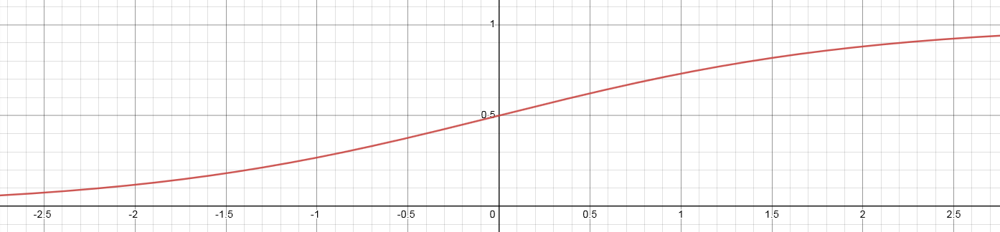
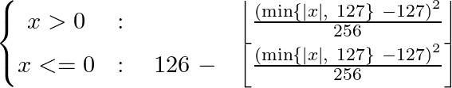
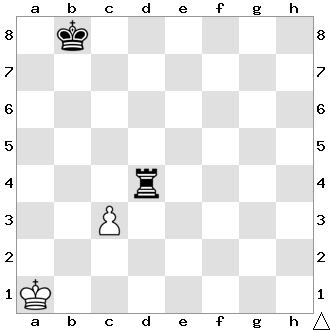

## Basics

### What is NNUE?

### 什么是NNUE？

NNUE (ƎUИИ Efficiently Updatable Neural Network) is, broadly speaking, a neural network architecture that takes advantage of having minimal changes in the network inputs between subsequent evaluations. It was invented for Shogi by [Yu Nasu](https://www.chessprogramming.org/Yu_Nasu), integrated into [YaneuraOu](https://github.com/yaneurao/YaneuraOu) developed by Motohiro Isozaki in May 2018, and later ported to chess for use in Stockfish by [Hisayori Noda](https://www.chessprogramming.org/Hisayori_Noda) in June 2019, but is applicable to many other board games and perhaps even in other domains. NNUE operates on the following principles:

NNUE （ƎUИИ Efficiently Updatable Neural Network，快速可更新神经网络）宽泛的说，是一种


利用了

神经网络架构。

它是有那须有为将棋发明的，并于

1. The network should have relatively low amount of non-zero inputs.
2. The inputs should change as little as possible between subsequent evaluations.
3. The network should be simple enough to facilitate low-precision inference in integer domain.

1. 网络应当有相对少量的非零输入。
2. 输入遍哈
3. 网络应当足够简单从而利于 整数致于

Following the 1st principle means that when the network is scaled in size the inputs must become sparse. Current best architectures have input sparsity in the order of 0.1%. Small amount of non-zero inputs places a low upper bound on the time required to evaluate the network in cases where it has to be evaluated in its entirety. This is the primary reason why NNUE networks can be large while still being very fast to evaluate.


Following the 2nd principle (provided the first is being followed) creates a way to efficiently update the network (or at least a costly part of it) instead of reevaluating it in its entirety. This takes advantage of the fact that a single move changes the board state only slightly. This is of lower importance than the first principle and completely optional for the implementations to take advantage of, but nevertheless gives a measurable improvement in implementations that do care to utilize this.

Following the 3rd principle allows achieving maximum performance on common hardware and makes the model especially suited for low-latency CPU inference which is necessary for conventional chess engines.

Overall the NNUE principles are applicable also to expensive deep networks, but they shine in fast shallow networks, which are suitable for low-latency CPU inference without the need for batching and accelerators. The target performance is million(s) of evaluations per second per thread. This is an extreme use case that requires extreme solutions, and most importantly **quantization**.

#### Quantization 101 and its importance

Quantization is the process of changing the domain of the neural network model from floating point to integer. NNUE networks are designed to be evaluated fast in low-precision integer domain, and can utilize available int8/int16 performance of modern CPUs to the fullest extent. Floating point is not an option for achieving maximum engine strength as it sacrifices too much speed for too little accuracy gains (though floating point representation is used by some engines due to its simplicity). Quantization inevitably introduces error that accumulates more the deeper the network is, however in the case of NNUE networks, which are relatively shallow, this error is neglibible. Quantization will be described in more detail later in this document. Until then this document will be using floats instead of ints, it won't be important until we get to actual code optimization. The purpose of this interjection is to make the reader aware of the ultimate goal of NNUE, as it is the biggest factor that shapes the NNUE models and dictates what is possible and what is not.

### What layers are useful in NNUE?

### 哪些层在NNUE中会用的上呢

NNUE relies on simple layers that can be implemented in low-precision environments using simple arithmetic. This means Linear (fully connected, basically matrix multiplication) and ClippedReLU (clamp(0, 1)) layers are particularly suitable for it. Pooling layers (mul/avg/max) or approximations of more complex activation functions (like sigmoid) are also suitable but not commonly used.

Usually such networks are kept shallow (2-4 layers), because most knowledge is kept in the first layer (which takes advantage of input sparsity to remain performant) and after that first layer the network needs to sharply reduce its width (the benefits of a deeper section in the later parts of the net would be dominated by the impact of the large first layers) to maintain performance requirements.

#### Linear layer

#### 线性层

A linear (fully connected) layer is just a simple matrix multiplication. It can be implemented efficiently, supports sparse inputs, and provides good capacity. It takes as an input `in_features` values, and produces `out_features` values. The operation is `y = Ax+b`, where:

`x` - the input column vector of size `in_features`

`A` - the weight matrix of size `(out_features, in_features)`

`b` - the bias column vector of size `out_features`

`y` - the output column vector of size `out_features`


#### Linear layer with sparse inputs

The multiplication `Ax` can be conceptually simplified to "if `x[i]` is not zero then take column `i` from `A`, multiply it by `x[i]` and add it to the result". Now it should be obvious that whenever an element of the input is zero we can skip processing the whole row of the weight matrix. This means that we have to only process as many columns of `A` as there are non-zero values in the input vector. Even though there may be tens of thousands of columns in the weight matrix, we're only concerned a few of them for each position! That's why the first layer can be so large.


#### Clipped ReLU layer

This an activation function based on normal ReLU, with a difference that it is bounded both from below and above. The formula is `y = min(max(x, 0), 1)`.


The purpose of this layer is to add non-linearity to the network. If it was just linear layers they could all be collapsed into one, because the matrices could be just multiplied together.

ClippedReLU would ideally be replaced with ReLU, but aggressive quantization requires reducing the dynamic range of hidden layer inputs, so capping the values at 1 becomes important for performance.

#### Sigmoid

This is an activation function that, contrary to [clipped] ReLU, is smooth. The formula is `y = 1/(1+e^-kx)`, where k is a parameter that determines how "stretched" the shape is.



There are two main differences compared to clipped ReLU:

1. sigmoid is smooth, meaning that it is differentiable everywhere, meaning that there is no situations (realistically speaking) where the gradient disappears.
2. sigmoid is nonlinear, the output saturates towards 0 or 1 but never reaches it

While this function generally allows the network to learn more than ReLU it is costly and unsuitable for evaluation in the integer domain. It is however a good starting point for improvements...

#### Quantmoid4

With sigmoid being too costly we need to look for alternatives. One such alternative is to use an approximation. And it just so happens that `sigmoid(4x)` (scaled to integer domain in a particular way) can be fairly well approximated by a simple piece-wise quadratic function that needs just addition, multiplication, and bit-shifts. Since the primary purpose for this approximation is to be used in a quantized implementation directly we will present a specific variant that outputs values in range `[0, 126]` (and with input scaled accordingly). The reason for the choice of the upper range being defined as 126 is that this is the largest even 8-bit integer, and want an even one to allow the value for `x=0` to be exactly in the middle. The equation is as follows:



Note, that the equation for both positive and negative `x` is almost identical. The similarity allows for a branchless implementation even though there are two cases.

And the resulting graph is the following (with a scaled sigmoid(4x) for comparison):


The disadvantage is that it loses the smoothness, and the output rounds to 0/1 quite early. This however doesn't appear to be an issue in practice, the actual error from this "rounding" is negligible.

More cool stuff will happen once we implement and optimize it, so we will get back to this layer in the optimized quantized implementation section.

#### Pooling layers

Sometimes it is desirable to reduce the input dimensionality to make the size of the layer more approachable. For example instead of having a `1024->8` layer, which has a very narrow output, one may prefer `512->16`. Pooling layers can provide some flexibility by reducing the dimensionality.

Pooling layers work by applying a function `F` over non-overlapping spans of the input, where `F` has more inputs than outputs. So for example one may have `F` take 2 consecutive inputs and produce one output, effectively halving the number of neurons.

The following types of pooling layers can be considered:

1. Average Pooling - outputs the average of inputs. Works well with any number of inputs.
2. Max Pooling - outputs the maximum of inputs. Works well with any number of inputs.
3. Product Pooling - outputs the product of inputs. Introduced by Stockfish, not common in machine learning in general. Only works well with 2 inputs. This one also appears to have similar benefits to sigmoid (quantmoid4); it increases the network's capacity, while other pooling layers only allow reducing dimensionality.

### A simple input feature set.

For the purpose of illustration we will consider a simple set of inputs based on piece placement. We will call it "A" features, because they will represent "All pieces".

There is 64 squares on the board, 6 piece types (pawn, knight, bishop, rook, queen, king), and 2 colors (white, black). What we want to encode as inputs are the positions of pieces, so each input will correspond to some (square, piece_type, color) tuple. There is `64*6*2=768` such tuples. If there is a piece `P` of color `C` on the square `S` we set the input `(S, P, C)` to 1, otherwise we set it to 0. Even though the total number of inputs is 768 there can only be 32 non-zero inputs in any given legal chess position, because there are only at most 32 pieces on the board. Moreover, any move can only change at most 4 inputs (castling), and the average should be below 3.

The binary and sparse nature of the inputs is utilized when passing the features to the neural network - the input is simply the list of features (indices), there's no need for a full input vector as other positions have value 0 and we know that each active feature has a value 1 associated with it.

Let's look at an example position `1k6/8/8/8/3r4/2P5/8/K7 w - - 0 1`.



On the board above we have 4 active features: `(A1, king, white)`, `(C3, pawn, white)`, `(B8, king, black)`, `(D4, rook, black)`.

Now let's consider the move c4 - the only feature that became invalid is the `(C3, pawn, white)`, it needs to be replaced with `(C4, pawn, white)`.

Now let's consider the move cxd4 - the pawn moved, so like before we remove `(C3, pawn, white)` and add `(D4, pawn, white)`. But also the rook got removed from the board, so we have to remove `(D4, rook, black)` too. This is still less work than recreating the inputs from scratch!

### A simple NNUE network

We will use our "A" feature set from the previous paragraph, so we have 768 inputs. The layers for the purpose of this illustration will be the 3 linear layers, 768->8, 8->8, 8->1. All layers are linear, and all hidden neurons use ClippedReLU activation function. The image below illustrates the architecture:

![A[768]->8->8->1 architecture diagram](img/A-768-8-8-1.svg)

The flow is from the left to the right. The first layer is a large fully connected layer with 768 inputs, but only a small fraction of them is non-zero for each position - sparse matrix vector multiplication can be utilized. Hidden layers are much smaller and always computed with dense matrix vector multiplication. At the end we get 1 output, which is usually trained to be the centipawn evaluation of the position (or proportional to it).

### Consideration of networks size and cost.

Choosing the right architecture is tricky as it's an accuracy/performance trade-off. Large networks provide more accurate evaluation, but the speed impact might completely negate the gains in real play. For example stockfish slowly transitioned from `256x2->32->32->1` to `1024x2->8->32->1`.

#### Feature set

When choosing a feature set it might be tempting to go into complicated domain specific knowledge, but the costs associated make simpler solutions more attractive. HalfKP, explained in detail earlier, is very simple, fast, and good enough. More sophisticated feature sets have been tried but they usually cannot combat the hit on performance. HalfKP features are easy to calculate, and change little from position to position.

Size also has to be considered. For the `256x2->32->32->1` architecture HalfKP inputs require about 10 million parameters in the first layer, which amounts to 20MB after quantization. For some uses it might not be an issue to have a very large set of features, with possibly hundreds of millions of parameters, but for a typical user it's inconvenient. Moreover, increasing the feature set size may reduce the training speed for some implementations, and certainly will require more time to converge.

#### First set of hidden neurons

The number of outputs in the first layer is the most crucial parameter, and also has the highest impact on speed and size. The costs associated with this parameter are two-fold. For one, it increases the number of operations required when updating the accumulator. Second, for optimized implementations, one must consider the number of available registers - in Stockfish going past 256 neurons requires multiple passes over the feature indices as AVX2 doesn't have enough registers. It also partially determines the size of the first dense linear layer, which also greatly contributes to the total cost.

#### Further layers

Unlike in typical networks considered in machine learning here most of the knowledge is stored in the first layer, and because of that adding further small layers near the output adds little to accuracy, and may even be harmful if quantization is employed due to error accumulation. NNUE networks are kept unusually shallow, and keeping the size of the later layers small increases performance.

### Accumulator

Even though we observed that few inputs change from position to position we have yet to take advantage of that. Recall that a linear layer is just adding some weight matrix columns together. Instead of recomputing the first set of hidden neurons for each position we can keep them as part of the position's state, and update it on each move based on what features (columns) were added or removed! We have to handle only two simple cases:

1. the feature `i` was removed from the input (1 -> 0) - subtract column `i` of the weight matrix from the accumulator
2. the feature `i` was added to the input (0 -> 1) - add column `i` of the weight matrix to the accumulator

For a single move it's trivial to find which "A" features changed - we know what piece we're moving, from where, and where to. Captures and promotions can be considered as a piece disappearing or appearing from nowhere.

However, care must taken when using floating point values. Repeatedly adding and subtracting floats results in error that accumulates with each move. It requires careful evaluation whether the error is small enough for the net to still produce good results. Thankfully, it is best implemented such that the accumulator is not updated when undoing a move. Instead, it is simply stored on the search stack, so the error is bounded by `O(MAX_DEPTH)` and can mostly be ignored.

When using quantization this is no longer a problem, the incremental implementation is consistent, but now there is a possibility of overflowing the accumulator (regardless of whether incremental updates are used or not). The quantization scheme must be chosen such that no combination of possible active features can exceed the maximum value.

### HalfKP

HalfKP is the most common feature set and other successful ones build on top of it. It fits in a sweet spot of being just the right size, and requiring very few updates per move on average. Each feature is a tuple `(our_king_square, piece_square, piece_type, piece_color)`, where `piece_type` is not a king (in HalfKA feature set kings are included). This means that for each king position there is a set of features `P`, which are `(piece_square, piece_type, piece_color)`. This allows the net to better understand the pieces in relation to the king. The total number of features is `64*64*5*2=40960`. (Note that there is a leftover from Shogi in the current Stockfish implementation and there are 64 additional features that are unused, but we will disregard them in this document). The feature index can be calculated as
```cpp
p_idx = piece_type * 2 + piece_color
halfkp_idx = piece_square + (p_idx + king_square * 10) * 64
```
The one special case that needs to be handled is when the king moves, because it is tied to all the features. All features are changed, so an accumulator refresh is executed. This makes king moves more costly but on average it still keeps the number of updates per evaluation low.

Now, you might ask, "but which king?!". The answer is both...

#### Multiple perspectives, multiple accumulators

This is where we need to start accounting for the features of both sides separately. The white side will keep its own accumulator, and the black side its own accumulator too. Effectively, it means that the maximum active number of features is twice as high as for a simple feature set with only one perspective. There will be twice as many updates and the accumulator will be twice as large in total, but overall this tradeoff between speed and accuracy is worth it. This approach inevitably creates some problems, options, and choices with regard to the exact model topology. Let's go through them one by one.

##### How to combine multiple accumulator perspectives?

Since we now have two accumulators, we need to somehow combine them into one vector that gets passed further into the network. This can be solved in two (three) ways. Let's denote the accumulator for white as `A_w`, and the accumulator for black as `A_b`.

1. concatenate the `A_w` and `A_b`, placing `A_w` first and `A_b` second. This is the simplest option. The output in this case is always relative to the white's perspective.
2. concatenate the `A_w` and `A_b`, placing `A_w` first if it's white to move, otherwise `A_b` first, and the other accumulator second. This approach has the advantage that the net can learn tempo. It now knows whose turn it is, which is an important factor in chess and can have a huge impact on evaluation of some positions. The output in this case is always relative to the side to move perspective.
3. Either 1 or 2, but instead of concatenating interleave. So `A_w[0], A_b[0], A_w[1], A_b[1], ...`. This might be advantageous in some exotic architectures where not always the whole combined accumulator is used, in which case interleaving means that the slice used always contains the same number of outputs from white's and from black's perspectives. This might become useful, for example when employing structured sparsity to the first hidden layer, which ultimately works on the subset of the accumulator.

##### Which set of weights to use for each perspective?

So we compute the features for white and black the same, are their weights related? They can be, but it's not required. Engines differ in the handling of this.

1. Same weights for both perspectives. This means the the board state needs to somehow be oriented. Otherwise white king on E1 would produce a different subset of features than a black king on E8, and white king on G4 would produce the same subset of features as a black king on G4. That's bad. The solution is to mirror the position and swap the color of the pieces for black's perspective; then the piece placement to feature mapping is logical for both. White king on E1 from white's perspective should be the same as a black king on E8 from black's perspective. Now you may think that flip is the way to go, but while chess has vertical symmetry, Shogi has rotational symmetry. The initial implementation of HalfKP in Stockfish used rotation to change the perspective, which is arguably incorrect for chess, but it worked surprisingly well.
2. Different weights for different perspectives. Is the white king on E1 actually equal to black king on E8? What about other pieces? Arguably one plays the game differently as black compared to as white, and it seems it makes sense to use different features for these perspectives. This is how some engines do it, and there's nothing wrong with this. The only downsides are larger size and slightly longer training time, but other than that it might even be better! It also completely removes the discussion about flip or rotate, which makes the implementation simpler.

#### HalfKP example and network diagram

Similar to the diagram above for the "A" feature set, here is the diagram for the same network but with HalfKP feature set, with combined weights. With a change that both accumulators are of size 4, so the network is in the end `HalfKP[40960]->4x2->8->1`

Let's look at the same example position as before: `1k6/8/8/8/3r4/2P5/8/K7 w - - 0 1`.


Now we have two perspectives, and will list the features for both of them separately. Remember the features are `(our_king_square, piece_square, piece_type, piece_color)` and we use flip to orient the squares for black and the colors are reversed! (One can think of the "color" as "us" or "them")

White's perspective: `(A1, C3, pawn, white)`, `(A1, D4, rook, black)`

Blacks's perspective: `(B1, C6, pawn, black)`, `(B1, D5, rook, white)`

The network diagram looks more interesting now.

![HalfKP[40960]->4x2->8->1](img/HalfKP-40960-4x2-8-1.svg)
