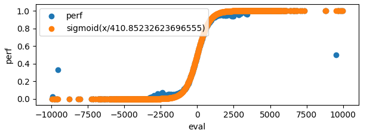
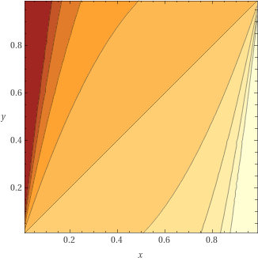

## Training a net with pytorch

This will be very brief, as this is on the nnue-pytorch repo after all so you can just look up the code! We will not explain how pytorch works, but we will, however, explain some of the basics, and the quirks needed to accommodate this exotic use case.

Let's continue using the architecture from the forward pass implementation.

### Model specification

Pytorch has built in types for linear layers, so defining the model is pretty simple.

```python
class NNUE(nn.Module):
    def __init__(self):
        super(NNUE, self).__init__()

        self.ft = nn.Linear(NUM_FEATURES, M)
        self.l1 = nn.Linear(2 * M, N)
        self.l2 = nn.Linear(N, K)

    # The inputs are a whole batch!
    # `stm` indicates the whether white is the side to move. 1 = true, 0 = false.
    def forward(self, white_features, black_features, stm):
        w = self.ft(white_features) # white's perspective
        b = self.ft(black_features) # black's perspective

        # Remember that we order the accumulators for 2 perspectives based on who is to move.
        # So we blend two possible orderings by interpolating between `stm` and `1-stm` tensors.
        accumulator = (stm * torch.cat([w, b], dim=1)) + ((1 - stm) * torch.cat([b, w], dim=1))

        # Run the linear layers and use clamp_ as ClippedReLU
        l1_x = torch.clamp(accumulator, 0.0, 1.0)
        l2_x = torch.clamp(self.l1(l1_x), 0.0, 1.0)
        return self.l2(l2_x)
```

Thankfully, Pytorch handles backpropagation automatically through automatic differentiation. Neat! The hard bit now is, maybe surprisingly, feeding the data.

### Preparing the inputs

There are two main bottlenecks in this part.

1. Parsing the training data sets
2. Preparing the tensor inputs

#### Parsing the training data sets and moving them to the python side

You might be tempted to implement this in python. It would work, but sadly, it would be orders of magnitude too slow. What we did in nnue-pytorch is we created a shared library in C++ that implements a very fast training data parser, and provides the data in a form that can be quickly turned into the input tensors.

We will use [Ctypes](https://docs.python.org/3/library/ctypes.html) for interoperation between C and Python. [Seer's trainer](https://github.com/connormcmonigle/seer-training/tree/6077a044c596963a34c504df8450aceaaa2b3fb1) uses pybind11 for example if you want more examples. In practice anything that provides a way to pass pointers and call C functions from Python will work. Other languages can be used too, but keep in mind that only C has a stable ABI, which makes things easier and more portable. So for example if you want to use C++ (like we will here) it's important to mark exported functions as `extern "C"`.

The data reader is passed a file on creation, and then it spawns the requested number of worker threads that chew through the data and prepare **whole batches** asynchronously. The batches are then passed to the python side and turned into PyTorch tensors. Going one sample at a time by one is not a viable option, corners need to be cut by producing whole batches. You may ask why? PyTorch can turn multiple tensors into a batch so what's the problem? Let's see...

Remember how the input is sparse? Now let's say our batch size is 8192. What would happen if we sent 8192 sparse tensors and tried to form a batch from them? Well, pytorch doesn't like doing that by itself, we need to help it. And the best way is to form one big 2d sparse input tensor that encompasses the whole batch. It has 2 sparse dimensions and the indices are `(position_index, feature_index)`, pretty simple, has great performance, and no need to create temporary tensors! The fact that we're forming whole batches from the start also means that we can reduce the amount of allocations and use a better memory layout for the batch parts.

Because of that we also cannot simply use the PyTorch's `DataLoader`, instead we need to use it as a mere wrapper. But this effort is worth it. One worker thread can usually saturate even a high end GPU without any issues.

#### Training batch structure and communication

The minimum that's needed are the features (from both perspectives), the side to move (for accumulator slice ordering), and the position evaluation (the score). Let's see how we can represent such a batch.

```cpp
struct SparseBatch {
    SparseBatch(const std::vector<TrainingDataEntry>& entries) {

        // The number of positions in the batch
        size = entries.size();

        // The total number of white/black active features in the whole batch.
        num_active_white_features = 0;
        num_active_black_features = 0;

        // The side to move for each position. 1 for white, 0 for black.
        // Required for ordering of the accumulator slices in the forward pass.
        stm = new float[size];

        // The score for each position. This is value that we will be teaching the network.
        score = new float[size];

        // The indices of the active features.
        // Why is the size * 2?! The answer is that the indices are 2 dimensional
        // (position_index, feature_index). It's effectively a matrix of size
        // (num_active_*_features, 2).
        // IMPORTANT: We must make sure that the indices are in ascending order.
        // That is first comes the first position, then second, then third,
        // and so on. And within features for one position the feature indices
        // are also in ascending order. Why this is needed will be apparent later.
        white_features_indices = new int[size * MAX_ACTIVE_FEATURES * 2];
        black_features_indices = new int[size * MAX_ACTIVE_FEATURES * 2];

        fill(entries);
    }

    void fill(const std::vector<TrainingDataEntry>& entries) {
        ...
    }

    int size;
    int num_active_white_features;
    int num_active_black_features;

    float* stm;
    float* score;
    int* white_features_indices;
    int* black_features_indices;

    ~SparseBatch()
    {
        // RAII! Or use std::unique_ptr<T[]>, but remember that only raw pointers should
        // be passed through language boundaries as std::unique_ptr doesn't have stable ABI
        delete[] stm;
        delete[] score;
        delete[] white_features_indices;
        delete[] black_features_indices;
    }
};
```

and in python

```python
class SparseBatch(ctypes.Structure):
    _fields_ = [
        ('size', ctypes.c_int),
        ('num_active_white_features', ctypes.c_int),
        ('num_active_black_features', ctypes.c_int),
        ('stm', ctypes.POINTER(ctypes.c_float)),
        ('score', ctypes.POINTER(ctypes.c_float)),
        ('white_features_indices', ctypes.POINTER(ctypes.c_int)),
        ('black_features_indices', ctypes.POINTER(ctypes.c_int))
    ]

    def get_tensors(self, device):
        # This is illustrative. In reality you might need to transfer these
        # to the GPU. You can also do it asynchronously, but remember to make
        # sure the source lives long enough for the copy to finish.
        # See torch.tensor.to(...) for more info.

        # This is a nice way to convert a pointer to a pytorch tensor.
        # Shape needs to be passed, remember we're forming the whole batch, the first
        # dimension is always the batch size.
        stm_t = torch.from_numpy(
            np.ctypeslib.as_array(self.stm, shape=(self.size, 1)))
        score_t = torch.from_numpy(
            np.ctypeslib.as_array(self.score, shape=(self.size, 1)))

        # As we said, the index tensor need to be transposed (not the whole sparse tensor!).
        # This is just how pytorch stores indices in sparse tensors.
        # It also requires the indices to be 64-bit ints.
        white_features_indices_t = torch.transpose(
            torch.from_numpy(
                np.ctypeslib.as_array(self.white_features_indices, shape=(self.num_active_white_features, 2))
            ), 0, 1).long()
        black_features_indices_t = torch.transpose(
            torch.from_numpy(
                np.ctypeslib.as_array(self.black_features_indices, shape=(self.num_active_white_features, 2))
            ), 0, 1).long()

        # The values are all ones, so we can create these tensors in place easily.
        # No need to go through a copy.
        white_features_values_t = torch.ones(self.num_active_white_features)
        black_features_values_t = torch.ones(self.num_active_black_features)

        # Now the magic. We construct a sparse tensor by giving the indices of
        # non-zero values (active feature indices) and the values itself (all ones!).
        # The size of the tensor is batch_size*NUM_FEATURES, which would
        # normally be insanely large, but since the density is ~0.1% it takes
        # very little space and allows for faster forward pass.
        # For maximum performance we do cheat somewhat though. Normally pytorch
        # checks the correctness, which is an expensive O(n) operation.
        # By using _sparse_coo_tensor_unsafe we avoid that.
        white_features_t = torch._sparse_coo_tensor_unsafe(
            white_features_indices_t, white_features_values_t, (self.size, NUM_FEATURES))
        black_features_t = torch._sparse_coo_tensor_unsafe(
            black_features_indices_t, black_features_values_t, (self.size, NUM_FEATURES))

        # What is coalescing?! It makes sure the indices are unique and ordered.
        # Now you probably see why we said the inputs must be ordered from the start.
        # This is normally a O(n log n) operation and takes a significant amount of
        # time. But here we **know** that the tensor is already in a coalesced form,
        # therefore we can just tell pytorch that it can use that assumption.
        white_features_t._coalesced_(True)
        black_features_t._coalesced_(True)

        # Now this is what the forward() required!
        return white_features_t, black_features_t, stm_t, score_t

# Let's also tell ctypes how to understand this type.
SparseBatchPtr = ctypes.POINTER(SparseBatch)
```

### Feature factorization

Let's focus on the features again. We will take a closer look on the `HalfKP` feature set. Hmm... We took `P`, and did it 64 times, once for each square... Surely these 64 buckets are somehow related... How could we tell the net that they are? By introducing virtual features!

We have 40960 `HalfKP` features and 640 `P` features. How to they map to each other? The exact computation will depend on your indexing scheme, but we can lay it out in simple terms.

`HalfKP` features are `(king_square, piece_square, piece_type, piece_color)`

`P` features are `(piece_square, piece_type, piece_color)`.

3 parts are common between the two. So for each `P` feature there is 64 corresponding `HalfKP` features. We can extend our 40960 inputs to 40960+640, including both `HalfKP` and `P` features. Now each position will have at most 64 features (32 `HalfKP`, and 32 `P`) for each perspective. Nothing else changes in the data loader, nor in the forward pass, we just added more features! But we don't want to use them in actual play, it would be too expensive, and kinda pointless. We know which features are correlated with each other, so let's just coalesce them somehow before using the network for play.

#### Virtual feature coalescing

So how can we coalesce them? Let's look how matrix and vector multiplication is done again. Consider the example position from before (`1k6/8/8/8/3r4/2P5/8/K7 w - - 0 1`).

:

Let's focus on the feature `(A1, C3, pawn, white)`. Now, we're also gonna add a `P` feature `(C3, pawn, white)`. What happens when the input goes through the first layer?

```cpp
accumulator += weights[(A1, C3, pawn, white)];
accumulator += weights[(C3, pawn, white)];
```

which is equivalent to

```cpp
accumulator += weights[(A1, C3, pawn, white)] + weights[(C3, pawn, white)];
```

So the relation is very simple. We just need to add the weights of each `P` feature to all the related `HalfKP` feature weights!

#### Other factors

Sometimes it's possible to add even more factors. It should be noted however, that just adding more factors doesn't necessarily improve the training and may even cause it to regress. In general, whether using some factors helps or not depends on the training setup and the net being trained. It's always good to experiment with this stuff. With that said however, we can consider for example the following factors for `HalfKP`.

##### "K" factors

The king position, 64 features. This one requires some careful handling as a single position has this feature multiple times - the number of pieces on the board. This means that the input for this feature is no longer 1, but the number of position on the board instead. This is needed purely because with HalfKP the king feature is not encoded anywhere. HalfKA doesn't need it for example because it specifically has the feature for the king's position. In general, handling this is tricky, it may even require reducing the gradient for these features (otherwise the gradient is `input*weight`, but input is large compared to others).

##### "HalfRelativeKP" factors

In `HalfKP` we use the absolute piece position, but what if we encoded the position as relative to the king? There's 15x15 such relative position possible, and most of them correspond 1:many to some `HalfKP` feature. The HalfRelativeKP feature index could be calculated for example like this:
```cpp
int get_half_relative_kp_index(Color perspective, Square king_sq, Square piece_sq, Piece piece)
{
    const int p_idx = static_cast<int>(piece.type()) * 2 + (piece.color() != perspective);
    const Square oriented_king_sq = orient_flip(perspective, king_sq);
    const Square oriented_piece_sq = orient_flip(perspective, piece_sq);
    // The file/rank difference is always in range -7..7, and we need to map it to 0..15
    const int relative_file = oriented_piece_sq.file() - oriented_king_sq.file() + 7;
    const int relative_rank = oriented_piece_sq.rank() - oriented_king_sq.rank() + 7;
    return (p_idx * 15 * 15) + (relative_file * 15) + relative_rank;
}
```

#### Real effect of the factorizer

While the factorizer helps the net to generalize, it seems to only be relevant in the early stages, that is when the net doesn't really know anything yet. It accelerates the early stages of training and reduces sparsity of the input (some inputs are very rare otherwise). But it quickly becomes unimportant and in later stages of the training can be removed to gain some training speed (after all it can add a lot of active features).

### Loss functions and how to apply them

#### The Goal

Training a network is really just minimizing a loss function, which needs to be smooth and have a minimum at the "optimal" evaluation (the training target). For the purpose of NNUE, this is done by gradient descent through usual machine learning methods (there are also non-gradient methods that are not described here).

#### Converting the evaluation from CP-space to WDL-space

By CP-space we mean the centipawn scale (or something proportional, like engine's internal units). By WDL-space we mean 0=loss, 0.5=draw, 1=win.

It's of course possible to apply the loss function directly on the evaluation value (in CP-space), but this can lead to large gradients (or a lot of hyperparameter tuning), restricts the set of loss functions available, and doesn't allow using results for loss. We will focus on evaluation in WDL-space. But how to convert between these spaces? Usually the evaluation to performance correspondence can be well fitted by a sigmoid. For example in some data generated by Stockfish we have:




so in the code we may do the following:
```python
scaling_factor = 410 # this depends on the engine, and maybe even on the data
wdl_space_eval = torch.sigmoid(cp_space_eval / scaling_factor)
```

This transformation also has the nice effect that large evaluations become "closer" together, which aligns well with the real play, where large evaluations don't need to be that precise.

#### Using results along the evaluation

With the values for which we will compute loss being in WDL-space, we may now interpolate them with game results. We will introduce a `lambda_` parameter that governs the interpolation.
```python
# game_result is in WDL-space
wdl_value = lambda_ * wdl_space_eval + (1 - lambda_) * game_result
```

The interpolation can also be applied to the loss.
```python
loss_eval = ... # loss between model eval and position eval
loss_result = ... # loss between model eval and game result
loss = lambda_ * loss_eval + (1 - lambda_) * loss_result
```

Which way works better depends on your case :)

#### Mean Squared Error (MSE)

Now we know what we're trying to fit; let's look at how we will fit them.

This is a very simple loss function that just takes a square of the difference between the predicted value and the target. This results in a nice linear gradient.

With interpolation applied before:
```python
scaling = ... # depends on the engine and data. Determines the shape of
              # the sigmoid that transforms the evaluation to WDL space
              # Stockfish uses values around 400
wdl_eval_model = sigmoid(model(...) / scaling)
wdl_eval_target = sigmoid(target / scaling)
wdl_value_target = lambda_ * wdl_eval_target + (1 - lambda_) * game_result
loss = (wdl_eval_model - wdl_value_target)**2
```

With interpolation applied after:
```python
scaling = ...
wdl_eval_model = sigmoid(model(...) / scaling)
wdl_eval_target = sigmoid(target / scaling)
loss_eval   = (wdl_eval_model - wdl_eval_target)**2
loss_result = (wdl_eval_model - game_result)**2
loss = lambda_ * loss_eval + (1 - lambda_) * loss_result
```

Note: in practice the exponent can be >2. Higher exponents give more weight towards precision at a cost of accuracy. Stockfish networks had good training results with an exponent of 2.6 for example.

##### loss


##### grad


#### Cross entropy

This loss function is usually used for continuous classification problems, and our use case could be considered one.

Care must be taken around domain boundaries. Usually a very small value (epsilon) is added such that the values never reach 0 under the logarithm.

With interpolation applied before:
```python
epsilon = 1e-12 # to prevent log(0)
scaling = ...
wdl_eval_model = sigmoid(model(...) / scaling)
wdl_eval_target = sigmoid(target / scaling)
wdl_value_target = lambda_ * wdl_eval_target + (1 - lambda_) * game_result

# The first term in the loss has 0 gradient, because we always
# differentiate with respect to `wdl_eval_model`, but it makes the loss nice
# in the sense that 0 is the minimum.
loss = (wdl_value_target * log(wdl_value_target + epsilon) + (1 - wdl_value_target) * log(1 - wdl_value_target + epsilon))
      -(wdl_value_target * log(wdl_eval_model   + epsilon) + (1 - wdl_value_target) * log(1 - wdl_eval_model   + epsilon))
```

With interpolation applied after:
```python
epsilon = 1e-12 # to prevent log(0)
scaling = ...
wdl_eval_model = sigmoid(model(...) / scaling)
wdl_eval_target = sigmoid(target / scaling)

# The first term in the loss has 0 gradient, because we always
# differentiate with respect to `wdl_eval_model`, but it makes the loss nice
# in the sense that 0 is the minimum.
loss_eval   = (wdl_eval_target * log(wdl_eval_target + epsilon) + (1 - wdl_eval_target) * log(1 - wdl_eval_target + epsilon))
             -(wdl_eval_target * log(wdl_eval_model  + epsilon) + (1 - wdl_eval_target) * log(1 - wdl_eval_model  + epsilon))
loss_result = (game_result     * log(wdl_eval_target + epsilon) + (1 - game_result)     * log(1 - wdl_eval_target + epsilon))
             -(game_result     * log(wdl_eval_model  + epsilon) + (1 - game_result)     * log(1 - wdl_eval_model  + epsilon))
loss = lambda_ * loss_eval + (1 - lambda_) * loss_result
```

##### loss


##### grad



