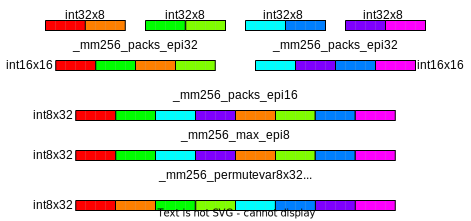

## Quantization

At the start of this document it was briefly mentioned what quantization is and that it will be important. Now it's the time to understand it properly. The goals is that we want to use the smallest possible integers everywhere. Most CPU architectures provide instructions that can work on 8, 16, 32, or even 64 int8 values at a time, and we should take advantage of that. That means we need to use int8 values, with range -128..127, for weights and inputs; or int16, with range -32768..32767, where int8 is not possible.

Coming up with the right quantization scheme is not easy, so first we'll present the one currently used by Stockfish, and then we'll explain how to get there, how to code it, and finally how to optimize it.

### Stockfish quantization scheme

#### Feature Transformer

Let's start with the feature transformer. Recall that its purpose is to accumulate between 0 to 30 (for HalfKP) rows of weights. We want to have int8 values as inputs to the later layers, with the activation range (ClippedReLU) being 0..127, but that means that using int8 integers for the accumulator doesn't provide enough space as the values would go beyond the range of int8 before applying the ClippedReLU... so we use int16 for the accumulator and then convert to int8 when doing the ClippedReLU.

#### Linear layer

We wanted int8 inputs and we can get them without losing too much precision. The nature of matrix-purposed SIMD instructions is that, thankfully, the accumulation happens in int32. So we don't experience the same issue as in the feature transformer where we're manually adding rows, and we can utilize the int8 multiplication with int32 accumulation to the fullest extent, and only later go back to int8 in the ClippedReLU layer.

#### ClippedReLU

Nothing special going on in here. Since the inputs are not being scaled, this is simply the same operation but in a different domain. Instead of clamping to 0..1 we clamp to 0..127. The input type is usually different than the output type as inputs will be either int32 or int16, and the output we want is int8. The values won't change but the conversion needs to be applied.

### The math of quantization and how to make it fit

To quantize the network we need to multiply the weights and biases by some constant to translate them to a different range of values. This poses a problem when confronted with multiplication during network inference - `(a*x) * (a*w) = a*a*x*w`, and we have to sometimes scale back the outputs too. But each layer is still independent so let's go through them one by one again.

#### Feature Transformer

Remember we want our activation range to change from 0..1 to 0..127. Since the feature transformer is a purely additive process,  it's enough that we multiply the weights and biases by 127. Both weights and biases are stored as int16. We could divide the output by some factor `a` to get more precision, in which case the weights and biases would have to be multiplied by `a*127` instead, but in practice it increases the accuracy only by a little bit.

#### Linear layer

To arrive at int8 weights we have to apply some scaling factor. This scaling factor ultimately depends on how much precision needs to be preserved, but cannot be too large because then the weights will be limited in magnitude. For example if we took the scaling factor to be 64 (used in Stockfish), then the maximum weight in the floating point space is `127/64=1.984375`. This is enough to have good nets, but care needs to be taken to clamp the weights during training so that they don't go outside that range. The scaling factor of 64 can also be understood as the smallest weight step that can be represented being `1/64=0.015625`.

A linear layer is just matrix multiplication, so we're multiplying inputs and weights, but now both are scaled relative to the float version. Let's denote the input scaling factor (activation range scaling) as `s_A`, and the weight scaling factor by `s_W`. `x` is the unquantized input, `w` is the unquantized weight, 'b' is the unquantized bias, and `y` is the unquantized output.
So we have:
```
x * w + b = y
((s_A * x) * (s_W * w)) + (b * s_A * s_W) = (y * s_A) * s_W
(((s_A * x) * (s_W * w)) + (b * s_A * s_W)) / s_W = (y * s_A)
```
From that we learn that we need to scale the bias by `(s_A * s_W)`, weights by `s_W`, and divide output by `s_W` to get the desired `(y * s_A)`, which is correctly scaled to the activation range.

Now, this applies only when the next layer is the ClippedReLU layer. For the last layer the output range is very different and the quantization will also be different. In Stockfish we want the last layer to output values in range -10000..10000 while still keeping int8 weights. This can be achieved without any additional scaling factors, but it's easiest to do and understand with an additional scaling factor.

We'll introduce a new scaling factor, `s_O`. This scaling factor, unlike others, needs to be applied to the output both during training (for loss calculation against the actual evaluation) and inference. The purpose of it is to scale the float output of the network to match the range of the integer evaluation used by Stockfish. Basically it means that `1` in the float space is equal to `s_O` internal evaluation units. It has an additional advantage that it allows us to have the layer weights be similar in magnitude to the previous layers.

So the math is now:
```
x * w + b = y
(((s_A * x) * (s_W * w)) + (b * s_A * s_W)) * s_O = ((y * s_A) * s_W) * s_O
(((s_A * x) * (s_W * w)) + (b * s_A * s_W)) * s_O / s_A / s_W = (y * s_O)
(((s_A * x) * (s_W / s_A * w)) + (b * s_A * s_W / s_A)) * s_O / s_W = (y * s_O)
(((s_A * x) * (s_W * s_O / s_A * w)) + (b * s_W * s_O)) / s_W = (y * s_O)
```
From that we learn that we need to scale the bias by `s_W * s_O`, weights by `s_W * s_O / s_A`, and divide the output by `s_W` to get the desired `(y * s_O)`.

### Implementation

For the unoptimized implementation not much changes. One just has to remember to change the data types to integers with desired size, scale weights on input, and divide the output from linear layers by `s_W`. `s_W` is usually chosen to be a power of two, so that this operation is a simple bitwise right shift, as there are no SIMD division instructions for integers and even if there were it would be slow.

### Optimized implementation

For simplicity we will focus on optimization only for the AVX2 extension of the x86-64 instruction set.

#### Feature Transformer

The benefit from SIMD for the feature transformer is two-fold:

1. multiple additions per instruction can be performed
2. large total register size means we don't need to write to memory as often

Our accumulation structure doesn't change much, we just change float to int16:
```cpp
// We now also make sure that the accumulator structure is aligned to the cache line.
// This is not strictly required by AVX2 instructions but may improve performance.
struct alignas(64) NnueAccumulator {
    // Two vectors of size N. v[0] for white's, and v[1] for black's perspectives.
    int16_t v[2][N];

    // This will be utilised in later code snippets to make the access less verbose
    int16_t* operator[](Color perspective) {
        return v[perspective];
    }
};
```

Now let's look at the refresh function. For simplicity we will assume that there is enough registers so that spills don't happen, but in reality (`M > 256`) it is required to do multiple passes over the active features, each time considering a part of the accumulator only. A single AVX2 register can fit 16 int16 values and there is 16 AVX2 registers (32 since AVX-512).

```cpp
void refresh_accumulator(
    const LinearLayer&      layer,            // this will always be L_0
    NnueAccumulator&        new_acc,          // storage for the result
    const std::vector<int>& active_features,  // the indices of features that are active for this position
    Color                   perspective       // the perspective to refresh
) {
    // The compiler should use one register per value, and hopefully
    // won't spill anything. Always check the assembly generated to be sure!
    constexpr int register_width = 256 / 16;
    static_assert(M % register_width == 0, "We're processing 16 elements at a time");
    constexpr int num_chunks = M / register_width;
    __m128i regs[num_chunks];

    // Load bias to registers and operate on registers only.
    for (int i = 0; i < num_chunks; ++i) {
        regs[i] = _mm256_load_si256(&layer.bias[i * register_width]);
    }

    for (int a : active_features) {
        for (int i = 0; i < num_chunks; ++i) {
            // Now we do 1 memory operation instead of 2 per loop iteration.
            regs[i] = _mm256_add_epi16(regs[i], &layer.weight[a][i * register_width]);
        }
    }

    // Only after all the accumulation is done do the write.
    for (int i = 0; i < num_chunks; ++i) {
        _mm256_store_si256(&new_acc[perspective][i * register_width], regs[i]);
    }
}
```

similarily for the update:

```cpp
void update_accumulator(
    const LinearLayer&      layer,            // this will always be L_0
    NnueAccumulator&        new_acc,          // it's nice to have already provided storage for
                                              // the new accumulator. Relevant parts will be overwritten
    const NNueAccumulator&  prev_acc,         // the previous accumulator, the one we're reusing
    const std::vector<int>& removed_features, // the indices of features that were removed
    const std::vector<int>& added_features,   // the indices of features that were added
    Color                   perspective       // the perspective to update, remember we have two,
                                              // they have separate feature lists, and it even may happen
                                              // that one is updated while the other needs a full refresh
) {
    // The compiler should use one register per value, and hopefully
    // won't spill anything. Always check the assembly generated to be sure!
    constexpr int register_width = 256 / 16;
    static_assert(M % register_width == 0, "We're processing 16 elements at a time");
    constexpr int num_chunks = M / register_width;
    __m128i regs[num_chunks];

    // Load the previous values to registers and operate on registers only.
    for (int i = 0; i < num_chunks; ++i) {
        regs[i] = _mm256_load_si256(&prev_acc[perspective][i * register_width]);
    }

    // Then we subtract the weights of the removed features
    for (int r : removed_features) {
        for (int i = 0; i < num_chunks; ++i) {
            regs[i] = _mm256_sub_epi16(regs[i], &layer.weight[r][i * register_width]);
        }
    }

    // Similar for the added features, but add instead of subtracting
    for (int a : added_features) {
        for (int i = 0; i < num_chunks; ++i) {
            regs[i] = _mm256_add_epi16(regs[i], &layer.weight[a][i * register_width]);
        }
    }

    // Only after all the accumulation is done do the write.
    for (int i = 0; i < num_chunks; ++i) {
        _mm256_store_si256(&new_acc[perspective][i * register_width], regs[i]);
    }
}
```

#### Linear layer

Matrix multiplication is hard to optimize in general, and there are many approaches depending on the size of the matrices. Since we expect the layers to be small, we will not delve into any fancy blocked algorithms. And just rely on manual unrolling and trying to process multiple values at a time. This is not optimal, but it's simple and very close. We will only describe the case where the number of outputs is divisible by 4. The output layer has 1 output but it's also very small and doesn't require anything clever. We will also require the input size to be a multiple of 32, otherwise adding 0 padding is required.

```cpp
int32_t* linear(
    const LinearLayer& layer,  // the layer to use. We have two: L_1, L_2
    int32_t*           output, // the already allocated storage for the result
    const int8_t*      input   // the input, which is the output of the previous CReLu layer
) {
    constexpr int register_width = 256 / 8;
    assert(layer.num_inputs % register_width == 0, "We're processing 32 elements at a time");
    assert(layer.num_outputs % 4 == 0, "We unroll by 4");
    const int num_in_chunks = layer.num_inputs / register_width;
    const int num_out_chunks = layer.num_outputs / 4;

    for (int i = 0; i < num_out_chunks; ++i) {
        // Prepare weight offsets. One offset for one row of weights.
        // This is a simple index into a 2d array.
        const int offset0 = (i * 4 + 0) * layer.num_inputs;
        const int offset1 = (i * 4 + 1) * layer.num_inputs;
        const int offset2 = (i * 4 + 2) * layer.num_inputs;
        const int offset3 = (i * 4 + 3) * layer.num_inputs;

        // Accumulation starts from 0, we add the bias only at the end.
        __m256i sum0 = _mm256_setzero_si256();
        __m256i sum1 = _mm256_setzero_si256();
        __m256i sum2 = _mm256_setzero_si256();
        __m256i sum3 = _mm256_setzero_si256();

        // Each innermost loop processes a 32x4 chunk of weights, so 128 weights at a time!
        for (int j = 0; j < num_in_chunks; ++j) {
            // We unroll by 4 so that we can reuse this value, reducing the number of
            // memory operations required.
            const __m256i in = _mm256_load_si256(&input[j * register_width]);

            // This function processes a 32x1 chunk of int8 and produces a 8x1 chunk of int32.
            // For definition see below.
            m256_add_dpbusd_epi32(sum0, in, _mm256_load_si256(&layer.weights[offset0 + j * register_width]));
            m256_add_dpbusd_epi32(sum1, in, _mm256_load_si256(&layer.weights[offset1 + j * register_width]));
            m256_add_dpbusd_epi32(sum2, in, _mm256_load_si256(&layer.weights[offset2 + j * register_width]));
            m256_add_dpbusd_epi32(sum3, in, _mm256_load_si256(&layer.weights[offset3 + j * register_width]));
        }

        const __m128i bias = _mm256_load_si256(&layer.bias[i * 4]);
        // This function adds horizontally 8 values from each sum together, producing 4 int32 values.
        // For the definition see below.
        __m128i outval = m256_haddx4(sum0, sum1, sum2, sum3, bias);
        // Here we account for the weights scaling.
        outval = _mm256_srai_epi32(outval, log2_weight_scale);
        _mm256_store_si256(&output[i * 4], outval);
    }

    return output + layer.num_outputs;
}
```

##### m256_add_dpbusd_epi32


The output needs to be horizontally accumulated further, but it's faster to do it with 4 sums (sum0, sum1, sum2, sum3) later.

This function can benefit from VNNI extension, here controlled by `USE_VNNI`.

```cpp
void m256_add_dpbusd_epi32(__m256i& acc, __m256i a, __m256i b) {
#if defined (USE_VNNI)

    // This does exactly the same thing as explained below but in one instruction.
    acc = _mm256_dpbusd_epi32(acc, a, b);

#else

    // Multiply a * b and accumulate neighbouring outputs into int16 values
    __m256i product0 = _mm256_maddubs_epi16(a, b);

    // Multiply product0 by 1 (idempotent) and accumulate neighbouring outputs into int32 values
    product0 = _mm256_madd_epi16(product0, kOnes256);

    // Add to the main int32 accumulator.
    acc = _mm256_add_epi32(acc, product0);

#endif
};
```

##### m256_haddx4

This function takes 4 \_\_m256i registers containing 8 int32 values each, accumulates them horizontally, and produces one \_\_m128i register containing 3 int32 values, each corresponding to one input sum. In the matrix multiplication above we keep one sum per weight row/input, so in the end we fill the output 4 values at a time.


```cpp
__m128i m256_haddx4(__m256i sum0, __m256i sum1, __m256i sum2, __m256i sum3, __m128i bias) {
    sum0 = _mm256_hadd_epi32(sum0, sum1);
    sum2 = _mm256_hadd_epi32(sum2, sum3);

    sum0 = _mm256_hadd_epi32(sum0, sum2);

    __m128i sum128lo = _mm256_castsi256_si128(sum0);
    __m128i sum128hi = _mm256_extracti128_si256(sum0, 1);

    return _mm_add_epi32(_mm_add_epi32(sum128lo, sum128hi), bias);
};
```

#### Linear layer with sparse input

In the previous part we described the generic dense matrix multiplication, but let's try to delve a little bit deeper. The case we will be considering here is similar to how our feature transformer operates, but here we always need to perform the full operation instead and the matrices are smaller. But why are we even considering this? Well, it turns out that the feature transformer output, after being passed through ClippedReLU, can have quite significant sparsity. Here is some data presenting the density of the inputs to the first dense fully connected layer, for networks with different feature transformer size:


(boxes corresponds to the [25%, 75%] interval, whiskers correspond to the [1%, 99%] interval)

That's already <=15% density for the common sizes, and it's consistent between different networks! However we cannot make it as much faster, there is some cost related to the changed access patterns and more required preprocessing, so whether this approach works for your particular case needs to be thoroughly tested.

Let's see the code that can take advantage of it.

```cpp
int lsb(std::uint32_t v) {
    // returns the least significant set bit in v
    // implementation detail
    // can be implemented for example using compiler intrinsics
    // https://www.chessprogramming.org/BitScan#Leading_Zero_Count
}

// This implementation requires changing the layout and expanding the weights to int16.
// We will transpose the weights as now we'll be going through the columns instead of rows.
void load_weights(
    const LinearLayer& layer,
    const int8_t* data
) {
    static_assert(is_same_v<LinearLayer::WeightType, int16_t>,
        "This approach requires weights to be 16 bit. Otherwise it's hard to widen the multiplication output to 32 bits.");

    for (int i = 0; i < layer.num_outputs; ++i) {
        for (int j = 0; j < layer.num_inputs; ++j) {
            layer.weights[j*layer.num_outputs + i] = data[i*layer.num_inputs + j];
        }
    }

    // For AVX2 we must also swap some lanes in the weights. This is
    // because AVX2 registers functions as two 128 bit ones, and
    // therefore some data is interleaved in the inference process.
    // This makes it so that they end up where we want.
    // Will be more apparent in the visualization.
    // This effectively swaps out the middle 2 64-bit chunks in each 256-bit chunk.
    for (int i = 0; i < layer.num_outputs; ++i) {
        for (int j = 0; j < layer.num_inputs; ++j) {
            const int simd_lane = j % 16;
            const int simd_lane_64 = simd_lane / 4;
            if (simd_lane_64 == 1) {
                swap(
                    layer.weights[i*layer.num_outputs + j + 0],
                    layer.weights[i*layer.num_outputs + j + 4]
                );
            }
        }
    }
}

int32_t* linear_sparse_input(
    const LinearLayer& layer,
    int32_t*           output,
    const int8_t*      input
) {
    static_assert(is_same_v<LinearLayer::WeightType, int16_t>,
        "This approach requires weights to be 16 bit. Otherwise it's hard to widen the multiplication output to 32 bits.");

    constexpr int register_width = 256 / 8;
    constexpr int input_register_width = register_width; // uint8_t
    constexpr int output_register_width = register_width / 4; // int32_t
    constexpr int output_chunk_size = output_register_width * 2; // we will be processing 2 registers at a time
    assert(layer.num_outputs % output_chunk_size == 0, "We're processing 16 output elements at a time");
    assert(layer.num_inputs % input_register_width == 0);

    // We need to find out the indices of the input values that are non-zero
    uint16_t nnz_input_indices[layer.num_inputs];
    int num_nnz_input_indices = 0;

    for (int i = 0; i < layer.num_inputs; i += input_register_width) {
        const __m256i input_chunk = _mm256_load_si256(input + i);
        // Find out where the values are greater than 0 and set the corresponding bits in nnz
        uint32_t nnz =
            _mm256_movemask_epi8(
                _mm256_cmpgt_epi8(input_chunk, _mm256_setzero_si256())
            );

        // Extract the indices of the set bits in nnz
        while (nnz) {
            const int lsb_index = lsb(nnz);
            nnz &= nnz - 1; // reset the least significant set bit in nnz
            nnz_input_indices[num_nnz_input_indices++] = i + lsb_index;
        }
    }

    // First we just copy the biases. Compilers are good at vectorizing this.
    // Could also use memcpy
    for (int i = 0; i < layer.num_outputs; ++i) {
        output[i] = layer.biases[i];
    }

    const int num_chunks = layer.num_outputs / output_chunk_size;
    int i = 0;
    for (; i + 1 < num_nnz_input_indices; i += 2) {
        // We will try to process 2 at a time as much as possible,
        // as we can utilize the available intrinsics better.
        // Will become more apparant on the visualization.
        const int input_id0 = nnz_input_indices[i+0];
        const int input_id1 = nnz_input_indices[i+1];
        const __m256i factor = _mm256_set1_epi32(
            input[input_id0] | (input[input_id1] << 16)
        );

        for (int j = 0; j < num_chunks; ++j) {
            const int output_offset0 = (j*2 + 0)*output_register_width;
            const int output_offset1 = (j*2 + 1)*output_register_width;

            // Weights are packed 2 times as densely as the output.
            const int weight_offset  = (j*1 + 0)*output_register_width;

            // Each chunk requires a load+store.
            // However, if the output is small enough it can be unrolled and
            // all outputs might fit into the registers.
            // Though the compiler probably is not allowed to do it by itself.
            __m256i sum0 = _mm256_load_si256(output + output_offset0);
            __m256i sum1 = _mm256_load_si256(output + output_offset1);

            // Remember, weights are 16 bit here, so one __m256i can hold 16 of them.
            const __m256i col0 = _mm256_load_si256(
                layer.weights + input_id0 * layer.num_outputs + weight_offset
            );
            const __m256i col1 = _mm256_load_si256(
                layer.weights + input_id1 * layer.num_outputs + weight_offset
            );

            // See next below for visualization
            m256_process_chunk(sum0, sum1, col0, col1, factor);

            _mm256_store_si256(output + output_offset0, sum0);
            _mm256_store_si256(output + output_offset1, sum1);
        }
    }

    // Process the remaining single input
    for (; i < num_nnz_input_indices; ++i) {
        const int input_id = nnz_input_indices[i];
        const __m256i factor = _mm256_set1_epi32(input[input_id]);

        for (int j = 0; j < num_chunks; ++j) {
            const int output_offset0 = (j*2 + 0)*output_register_width;
            const int output_offset1 = (j*2 + 1)*output_register_width;

            const int weight_offset  = (j*1 + 0)*output_register_width;

            __m256i sum0 = _mm256_load_si256(output + output_offset0);
            __m256i sum1 = _mm256_load_si256(output + output_offset1);

            const __m256i col0 = _mm256_load_si256(
                layer.weights + input_id * layer.num_outputs + weight_offset
            );

            m256_process_chunk(sum0, sum1, col0, _mm256_setzero_si256(), factor);

            _mm256_store_si256(output + output_offset0, sum0);
            _mm256_store_si256(output + output_offset1, sum1);
        }
    }

    return output + layer.num_outputs;
}
```

##### m256_process_chunk

This function takes int16 weights, a factor being a composition of 2 int8 inputs broadcasted as int32, and produces int32 outputs.


```cpp
inline void m256_process_chunk(__m256i& sum0, __m256i& sum1, __m256i col0, __m256i col1, __m256i factor) {
    // We interleave the two columns, because madd adds adjacent values.
    // This way we effectively add the results from both columns.
    sum0 = _mm256_add_epi32(
        sum0, _mm256_madd_epi16(factor, _mm256_unpacklo_epi16(col0, col1))
    );
    sum1 = _mm256_add_epi32(
        sum1, _mm256_madd_epi16(factor, _mm256_unpackhi_epi16(col0, col1))
    );
}
```

#### Linear layer with sparse input, alternative approach

In the first approach we used 16-bit weights, but it's possible to use 8-bit weights with slightly more unpacking fun. We'll also see an alternative way of computing the indices on non-zero inputs by using a lookup table. For some more approaches and measurements to the latter see [here](https://github.com/syzygy1/Cfish/issues/204#issue-944790893).

```cpp
// This implementation requires changing the layout and expanding the weights to int16.
// We will transpose the weights as now we'll be going through the columns instead of rows.
void load_weights(
    const LinearLayer& layer,
    const int8_t* data
) {
    static_assert(is_same_v<LinearLayer::WeightType, int8_t>,
        "This approach requires weights to be 8 bit.");

    for (int i = 0; i < layer.num_outputs; ++i) {
        for (int j = 0; j < layer.num_inputs; ++j) {
            layer.weights[j*layer.num_outputs + i] = data[i*layer.num_inputs + j];
        }
    }

    // No need for clever tricks with shuffling the weights now.
    // However, we will require one more zero weight column. We assume enough space is allocated.
    for (int i = 0; i < layer.num_outputs; ++i) {
        layer.weights[layer.num_inputs*layer.num_outputs + i] = 0;
    }
}

// A constexpr version of least significant bit computation.
static constexpr int lsb_constexpr(std::uint32_t v)
{
    int c = 0;
    if (!v) return 32;
    while (!(v & 1))
    {
        v >>= 1;
        ++c;
    }
    return c;
}

// A lookup table of indices of non-zero bits in the input.
// Each entry of std::array<std::uint16_t, 8> can be interpreted as __m128i.
alignas(64) static constexpr std::array<std::array<std::uint16_t, 8>, 256> LookupTableIndices = [](){
    std::array<std::array<std::uint16_t, 8>, 256> v{};
    for (int i = 0; i < 256; ++i)
    {
        int j = i;
        int k = 0;
        while(j)
        {
            const IndexType lsbIndex = lsb_constexpr(std::uint32_t(j));
            j &= j - 1;
            v[i][k] = lsbIndex;
            ++k;
        }
    }
    return v;
}();

// A lookup table for popcount of a byte.
// Using the dedicated popcnt instruction might or might not work better.
static constexpr std::array<std::uint8_t, 256> LookupTableCounts = [](){
    std::array<std::uint8_t, 256> v{};
    for (int i = 0; i < 256; ++i)
    {
        int j = i;
        int k = 0;
        while(j)
        {
            j &= j - 1;
            ++k;
        }
        v[i] = k;
    }
    return v;
}();

int32_t* linear_sparse_input(
    const LinearLayer& layer,
    int32_t*           output,
    const int8_t*      input
) {
    // We will take a tiled approach with accumulators in registers.
    // Similar to how the feature transformer is best implemented.
    constexpr int input_register_width = 256 / 8;
    constexpr int chunk_size = 256 / 32;
    constexpr int num_chunks_per_tile = 8;
    constexpr int tile_size = chunk_size * num_chunks_per_tile;
    assert(layer.num_outputs % tile_size == 0, "We're processing 64 output elements at a time. Though it's easy to change it.");
    assert(num_chunks_per_tile % 4 == 0, "We're processing 4 chunks at a time.");
    constexpr int num_tiles = layer.num_outputs / tile_size;

    // We need to find out the indices of the input values that are non-zero
    // We'll use a lookup table approach. Overallocate 16 elements
    // so that stores are always valid (we will be using larger stores)
    uint16_t nnz_input_indices[layer.num_inputs + 16];
    int num_nnz_input_indices = 0;

    {
        // These will be used for offseting the looked up indices.
        // A variation with int16 lookup is also possible (see the link above)
        // and is faster in isolation, but requires more memory and may trash the cache.
        __m128i base = _mm_set1_epi16(0);
        __m128i increment = _mm_set1_epi16(8);
        for (int i = 0; i < layer.num_inputs; i += input_register_width) {
            const __m256i input_chunk = _mm256_load_si256(input + i);
            unsigned nnz = _mm256_movemask_epi8(_mm256_cmpgt_epi8(input_chunk, _mm256_setzero_si256()));

            unsigned b0 = (nnz) & 0xFF;
            unsigned b1 = (nnz >> 8) & 0xFF;
            unsigned b2 = (nnz >> 16) & 0xFF;
            unsigned b3 = (nnz >> 24) & 0xFF;

            unsigned c0 = LookupTableCounts[b0];
            unsigned c1 = LookupTableCounts[b1];
            unsigned c2 = LookupTableCounts[b2];
            unsigned c3 = LookupTableCounts[b3];

            // These stores can reach above layer.num_inputs in extreme cases. That's why we preallocate.
            // Only the first c0 values matter.
            _mm_storeu_si128(
                reinterpret_cast<__m128i*>(nnz_input_indices + num_nnz_input_indices),
                _mm_add_epi32(_mm_loadu_si128(reinterpret_cast<const __m128i*>(&LookupTableIndices[b0])), base)
            );
            num_nnz_input_indices += c0;
            base = _mm_add_epi32(base, increment);

            _mm_storeu_si128(
                reinterpret_cast<__m128i*>(nnz_input_indices + num_nnz_input_indices),
                _mm_add_epi32(_mm_loadu_si128(reinterpret_cast<const __m128i*>(&LookupTableIndices[b1])), base)
            );
            num_nnz_input_indices += c1;
            base = _mm_add_epi32(base, increment);

            _mm_storeu_si128(
                reinterpret_cast<__m128i*>(nnz_input_indices + num_nnz_input_indices),
                _mm_add_epi32(_mm_loadu_si128(reinterpret_cast<const __m128i*>(&LookupTableIndices[b2])), base)
            );
            num_nnz_input_indices += c2;
            base = _mm_add_epi32(base, increment);

            _mm_storeu_si128(
                reinterpret_cast<__m128i*>(nnz_input_indices + num_nnz_input_indices),
                _mm_add_epi32(_mm_loadu_si128(reinterpret_cast<const __m128i*>(&LookupTableIndices[b3])), base)
            );
            num_nnz_input_indices += c3;
            base = _mm_add_epi32(base, increment);
        }
    }

    // We will be processing 4 inputs at a time, and to avoid having two similar loops
    // we pad the input indices to a multiple of 4. For the added ones we use a dummy input
    // with all weights set to 0.
    while (num_nnz_input_indices % 4 != 0)
      nnz_input_indices[num_nnz_input_indices++] = layer.num_inputs;

    // Hopefully will fit in the register file.
    __m256i acc[num_chunks_per_tile];

    for (int i = 0; i < num_tiles; ++i)
    {
        const __m256i* biases_tile = reinterpret_cast<const __m256i*>(&layer.biases[i * tile_size]);
              __m256i* output_tile = reinterpret_cast<      __m256i*>(&      output[i * tile_size]);

        for (int k = 0; k < num_chunks_per_tile; ++k)
            acc[k] = _mm256_setzero_si256();

        for (int j = 0; j < num_nnz_input_indices; j += 4)
        {
            const __m256i  mul0 = _mm256_set1_epi16(input[nnz_input_indices[j+0]] | (input[nnz_input_indices[j+1]] << 8));
            const __m256i  mul2 = _mm256_set1_epi16(input[nnz_input_indices[j+2]] | (input[nnz_input_indices[j+3]] << 8));
            const __m256i* col0 = reinterpret_cast<const __m256i*>(&layer.weights[nnz_input_indices[j+0] * layer.num_outputs + i * tile_size]);
            const __m256i* col1 = reinterpret_cast<const __m256i*>(&layer.weights[nnz_input_indices[j+1] * layer.num_outputs + i * tile_size]);
            const __m256i* col2 = reinterpret_cast<const __m256i*>(&layer.weights[nnz_input_indices[j+2] * layer.num_outputs + i * tile_size]);
            const __m256i* col3 = reinterpret_cast<const __m256i*>(&layer.weights[nnz_input_indices[j+3] * layer.num_outputs + i * tile_size]);
            for (int k = 0; k < num_chunks_per_tile / 4; ++k)
            {
                // Due to AVX2 interpreting the 256-bit registers as 2 128-bit ones the unpacking
                // shuffles the lanes. We will have to account for that when getting the final result.
                m256_process_chunk_alternative(
                    acc[k*4 + 0], acc[k*4 + 1], acc[k*4 + 2], acc[k*4 + 3],
                         col0[k],      col1[k],      col2[k],      col3[k],
                            mul0,                       mul2
                );
            }
        }

        for (int k = 0; k < num_chunks_per_tile / 4; ++k)
        {
            // We have to unshuffle the lanes. See the visualization to get a better picture.
            const __m128i acc00 = _mm256_extracti128_si256(acc[k*4 + 0], 0);
            const __m128i acc01 = _mm256_extracti128_si256(acc[k*4 + 0], 1);
            const __m128i acc10 = _mm256_extracti128_si256(acc[k*4 + 1], 0);
            const __m128i acc11 = _mm256_extracti128_si256(acc[k*4 + 1], 1);
            const __m128i acc20 = _mm256_extracti128_si256(acc[k*4 + 2], 0);
            const __m128i acc21 = _mm256_extracti128_si256(acc[k*4 + 2], 1);
            const __m128i acc30 = _mm256_extracti128_si256(acc[k*4 + 3], 0);
            const __m128i acc31 = _mm256_extracti128_si256(acc[k*4 + 3], 1);

            output_tile[k*4 + 0] = _mm256_add_epi32(_mm256_setr_m128i(acc00, acc10), biases_tile[k*4 + 0]);
            output_tile[k*4 + 1] = _mm256_add_epi32(_mm256_setr_m128i(acc20, acc30), biases_tile[k*4 + 1]);
            output_tile[k*4 + 2] = _mm256_add_epi32(_mm256_setr_m128i(acc01, acc11), biases_tile[k*4 + 2]);
            output_tile[k*4 + 3] = _mm256_add_epi32(_mm256_setr_m128i(acc21, acc31), biases_tile[k*4 + 3]);
        }
    }

    return output + layer.num_outputs;
}
```

##### m256_process_chunk_alternative

This function takes int8 weights corresponding to 4 inputs, 2 factors being a composition of 4 int8 inputs broadcasted as int16, and produces int32 outputs.


```cpp
inline void m256_process_chunk_alternative(
    __m256i& acc0, __m256i& acc1, __m256i& acc2, __m256i& acc3,
    __m256i  col0, __m256i  col1, __m256i  col2, __m256i  col3,
    __m256i  mul0,                __m256i  mul2
) {
    // For madd.
    const __m256i ones = _mm256_set1_epi16(1);

    const __m256i prod0 = _mm256_maddubs_epi16(mul0, _mm256_unpacklo_epi8(col0, col1));
    const __m256i prod1 = _mm256_maddubs_epi16(mul0, _mm256_unpackhi_epi8(col0, col1));
    const __m256i prod2 = _mm256_maddubs_epi16(mul2, _mm256_unpacklo_epi8(col2, col3));
    const __m256i prod3 = _mm256_maddubs_epi16(mul2, _mm256_unpackhi_epi8(col2, col3));
    acc0 = _mm256_add_epi32(acc0, _mm256_madd_epi16(ones, _mm256_unpacklo_epi16(prod0, prod2)));
    acc1 = _mm256_add_epi32(acc1, _mm256_madd_epi16(ones, _mm256_unpackhi_epi16(prod0, prod2)));
    acc2 = _mm256_add_epi32(acc2, _mm256_madd_epi16(ones, _mm256_unpacklo_epi16(prod1, prod3)));
    acc3 = _mm256_add_epi32(acc3, _mm256_madd_epi16(ones, _mm256_unpackhi_epi16(prod1, prod3)));
}
```

#### Linear layer with sparse input and blocked sparse output

Let's go one step further. For now all linear layers had dense outputs, but we can consider a layer where each input is connected only to a subset of outputs. We can consider the weights to be 0 where no connection is present. To make it possible to implement efficiently with vectorization in mind we have to zero out whole blocks of weights. A 16x128 Weight matrix with 2 non-zero 1x16 blocks per input may look like this for example:


For AVX2 such blocks must be at least 8 int32s (type of the output values) wide, but we will consider only 16-wide blocks because it's more convenient. With this approach one can have for example a linear layer with 256 outputs, but only 4 (this being constant is quite important for being able to write optimized code) non-zero weight blocks of size 16 per input, effectively having each input only affect 64 outputs.

There is some additional workload in the forward pass to support it, and it doesn't vectorize as nicely as previous cases, but it might still be a win for some architectures.

However, with this approach the training needs to be aware of this and try to create those blocks of 0 weights without harming the network too much. This can be achieved with weight pruning, which will be described later. The inference code will be very similar to the linear layer with sparse inputs case.


```cpp
void load_weights(
    const LinearLayer& layer,
    const int8_t* data
) {
    // This goes the same as in the case with sparse inputs, however
    // the weights matrix is no longer continuous and we need to fill
    // some block indices to know which weights correspond to which ouputs.
    // This can be done either by discovering the zero blocks during loading,
    // or with a different serialized format with the block indices precomputed.
    // We will omit this here and just assume that layer.nnz_block_ids[input_id][4]
    // contains non-zero weight block indices corresponding to each input.
}

int32_t* linear_sparse_input_block_sparse_output(
    const LinearLayer& layer,
    int32_t*           output,
    const int8_t*      input
) {
    static_assert(is_same_v<LinearLayer::WeightType, int16_t>,
        "This approach requires weights to be 16 bit. Otherwise it's hard to widen the multiplication output to 32 bits.");

    constexpr int register_width = 256 / 8;
    constexpr int input_register_width = register_width; // uint8_t
    constexpr int output_register_width = register_width / 4; // int32_t
    constexpr int output_chunk_size = output_register_width * 2; // we will be processing 2 registers at a time
    assert(layer.num_outputs % output_chunk_size == 0, "We're processing 16 output elements at a time");
    assert(layer.num_inputs % input_register_width == 0);

    uint16_t nnz_input_indices[layer.num_inputs];
    int num_nnz_input_indices = 0;

    for (int i = 0; i < layer.num_inputs; i += input_register_width) {
        const __m256i input_chunk = _mm256_load_si256(input + i);
        uint32_t nnz =
            _mm256_movemask_epi8(
                _mm256_cmpgt_epi8(input_chunk, _mm256_setzero_si256())
            );

        while (nnz) {
            const int lsb_index = lsb(nnz);
            nnz &= nnz - 1; // reset the least significant set bit in nnz
            nnz_input_indices[num_nnz_input_indices++] = i + lsb_index;
        }
    }

    for (int i = 0; i < layer.num_outputs; ++i) {
        output[i] = layer.biases[i];
    }

    const int num_chunks = layer.num_outputs / output_chunk_size;
    // There are always tradeoffs. We cannot process two inputs at a time, because
    // they might have different non-zero weight blocks. Makes it visibly slower.
    // There might be some tricks with AVX512, but AVX2 is fairly limited for this use case.
    for (int i = 0; i < num_nnz_input_indices; ++i) {
        const int input_id = nnz_input_indices[i]
        const __m256i factor = _mm256_set1_epi32(input[input_id]);

        // We have hardcoded 4 16-wide non-zero weight blocks per input.
        for (int j = 0; j < 4; ++j) {
            const int block_id = layer.nnz_block_ids[input_id][j];
            const int output_offset0 = (block_id*2 + 0)*output_register_width;
            const int output_offset1 = (block_id*2 + 1)*output_register_width;

            const int weight_offset  = (block_id*1 + 0)*output_register_width;

            __m256i sum0 = _mm256_load_si256(output + output_offset0);
            __m256i sum1 = _mm256_load_si256(output + output_offset1);

            const __m256i col0 = _mm256_load_si256(
                layer.weights + input_id * layer.num_outputs + weight_offset
            );

            m256_process_chunk(sum0, sum1, col0, _mm256_setzero_si256(), factor);

            _mm256_store_si256(output + output_offset0, sum0);
            _mm256_store_si256(output + output_offset1, sum1);
        }
    }

    return output + layer.num_outputs;
}
```

#### ClippedReLU

The clipping is not hard, the more complicated part is conversion. We also need two version, one for int16 -> int8, and one for int32 -> int8.

##### int16 -> int8


```cpp
int8_t* crelu16(,
          int      size,   // no need to have any layer structure, we just need the number of elements
          int8_t*  output, // the already allocated storage for the result
    const int16_t* input   // the input, which is the output of the previous linear layer
) {
    constexpr int in_register_width = 256 / 16;
    constexpr int out_register_width = 256 / 8;
    assert(size % out_register_width == 0, "We're processing 32 elements at a time");
    const int num_out_chunks = size / out_register_width;

    const __m256i zero    = _mm256_setzero_si256();
    const int     control = 0b11011000; // 3, 1, 2, 0; lane 0 is the rightmost one

    for (int i = 0; i < num_out_chunks; ++i) {
        const __m256i in0 = _mm256_load_si256(&input[(i * 2 + 0) * in_register_width]);
        const __m256i in1 = _mm256_load_si256(&input[(i * 2 + 1) * in_register_width]);

        const __m256i result =
            // packs changes the order, so we need to fix that with a permute
            _mm256_permute4x64_epi64(
                // clamp from below
                _mm256_max_epi8(
                    // packs saturates to 127, so we only need to clamp from below
                    _mm256_packs_epi16(in0, in1),
                    zero
                ),
                control
            );

        _mm256_store_si256(&output[i * out_register_width], result);
    }

    return output + size;
}
```

##### int32 -> int8



```cpp
int8_t* crelu32(,
          int      size,   // no need to have any layer structure, we just need the number of elements
          int8_t*  output, // the already allocated storage for the result
    const int32_t* input   // the input, which is the output of the previous linear layer
) {
    constexpr int in_register_width = 256 / 32;
    constexpr int out_register_width = 256 / 8;
    assert(size % out_register_width == 0, "We're processing 32 elements at a time");
    const int num_out_chunks = size / out_register_width;

    const __m256i zero    = _mm256_setzero_si256();
    const __m256i control = _mm256_set_epi32(7, 3, 6, 2, 5, 1, 4, 0);

    for (int i = 0; i < num_out_chunks; ++i) {
        const __m256i in0 =
            _mm256_packs_epi32(
                _mm256_load_si256(&input[(i * 4 + 0) * in_register_width]),
                _mm256_load_si256(&input[(i * 4 + 1) * in_register_width])
            );
        const __m256i in1 =
            _mm256_packs_epi32(
                _mm256_load_si256(&input[(i * 4 + 2) * in_register_width]),
                _mm256_load_si256(&input[(i * 4 + 3) * in_register_width])
            );

        const __m256i result =
            _mm256_permutevar8x32_epi32(
                _mm256_max_epi8(
                    _mm256_packs_epi16(in0, in1),
                    zero
                ),
                control
            );

        _mm256_store_si256(&output[i * out_register_width], result);
    }

    return output + size;
}
```

#### Quantmoid4

As previously mentioned, we will be considering the variant with output in range `[0, 126]`. Let's remind ourselves about the equation we need to implement.


First thing to notice is that `min(x, y) - y` can be replaced by `-subs(y, x)`, where `subs` is unsigned subtraction with saturation, in this case saturation to the range `[0, 255]`.

For handling the "piece-wise" nature we can either use a copysign function, or a blend function. Since blending is available in AVX2 we will use this.

The code can then be as simple as the following:

```cpp
// Since the output is always 0/1 outside of the int8 range the input could
// in theory be (saturated) int8, BUT there is no int8 multiplication in AVX2 so we
// will take int16 for convenience.
int8_t* quantmoid4(
          int      size,
    const int16_t* input,
          int8_t*  output
) {
    constexpr int in_register_width = 256 / 16;
    constexpr int out_register_width = 256 / 8;
    assert(size % out_register_width == 0); // We won't bother with the remainder here
    const int num_out_chunks = size / out_register_width;

    const __m256i cst_127_epi16 = _mm256_set1_epi16(127);
    const __m256i cst_126_epi8 = _mm256_set1_epi8(126);

    // Since AVX2 processes interleaves between 128-bit lanes we will have to
    // revert this at the end, to combine two processed inputs into one output.
    // This Control contains the information how to permute the 64-bit lanes
    // of the result. Control = [0, 2, 1, 3].
    constexpr int Control = 0b11011000;
    for (int i = 0; i < num_out_chunks; ++i)
    {
        __m256i v0 = _mm256_load_si256(&input[(i * 2 + 0) * in_register_width]);
        __m256i v1 = _mm256_load_si256(&input[(i * 2 + 1) * in_register_width]);

        // We will need the initial input sign for the blend later.
        // Blend uses the highest bit only for the choice, and that
        // happens to be the sign bit.
        __m256i sign = _mm256_packs_epi16(v0, v1);

        // From the identity stated earlier.
        // v0 = min(abs(input[i]), 127) - 127;
        v0 = _mm256_subs_epu16(cst_127_epi16, _mm256_abs_epi16(v0));
        v1 = _mm256_subs_epu16(cst_127_epi16, _mm256_abs_epi16(v1));

        // Since we use mulhi later we have to prepare the input such that
        // the high part (16 highest bits, as the 16-bit multiplication produces
        // a 32-bit result) after the multiplication land correctly. We want to
        // divide by 256==2^8 later (right shift by 8), so we would have 8 spare
        // bits that we would need to get rid of (from the full 32-bit result).
        // So we can first shift left by 4 bits, which the multiplication (squaring)
        // will double to 8, and so the 16-bit high part of the 32-bit result will
        // exctract exactly what we want.
        v0 = _mm256_slli_epi16(v0, 4);
        v1 = _mm256_slli_epi16(v1, 4);

        v0 = _mm256_mulhi_epi16(v0, v0);
        v1 = _mm256_mulhi_epi16(v1, v1);

        // Now we can convert to int8 after that for the rest.
        v0 = _mm256_packs_epi16(v0, v1);

        // Blend between v and 126-v, based on the input sign, so that we effectively
        // evaluate the right part of the piece-wise function.
        v0 = _mm256_blendv_epi8(_mm256_subs_epi8(cst_126_epi8, v0), v0, sign);

        // Deinterleave the output due to AVX2 semantics.
        _mm256_store_si256(&output[i * out_register_width], _mm256_permute4x64_epi64(v0, Control));
    }

    return output + size;
}
```

#### Pooling Layers

##### Average Pooling

The exact implementation will depend on how many inputs per output one wants to take. Here we will show an implementation which reduces 2 inputs into 1 output, and will work on uint8 input.

Note, that it is often not optimal to take the neighbouring values. For example here we divide the input in half and average those halves, as there is no instruction in AVX2 that allows to do it well otherwise. Also, be aware of rounding differences - for example AVX2 avg rounds towards nearest integer, while a simple division will round towards 0.

```cpp
void average_pooling_2(
          int      size,
    const uint8_t* input,
          uint8_t*  output
) {
    constexpr int register_width = 256 / 8;
    assert(size % (register_width * 2) == 0); // We won't bother with the remainder here
    const int num_out_chunks = size / (register_width * 2);

    for (int i = 0; i < num_out_chunks; ++i)
    {
        __m256i v0 = _mm256_load_si256(&input[ i                   * register_width]);
        __m256i v1 = _mm256_load_si256(&input[(i + num_out_chunks) * register_width]);

        _mm256_store_si256(&output[i * register_width], _mm256_avg_epu8(v0, v1));
    }
}
```

##### Max Pooling

Pretty much identical. Though there are more options for input/output types with `max` in AVX2.

```cpp
void max_pooling_2(
          int      size,
    const uint8_t* input,
          uint8_t*  output
) {
    constexpr int register_width = 256 / 8;
    assert(size % (register_width * 2) == 0); // We won't bother with the remainder here
    const int num_out_chunks = size / (register_width * 2);

    for (int i = 0; i < num_out_chunks; ++i)
    {
        __m256i v0 = _mm256_load_si256(&input[ i                   * register_width]);
        __m256i v1 = _mm256_load_si256(&input[(i + num_out_chunks) * register_width]);

        _mm256_store_si256(&output[i * register_width], _mm256_max_epu8(v0, v1));
    }
}
```

##### Product Pooling

This one is more complicated, since multiplication introduces a non-linearity that has to be accounted for in the quantization. We will consider a version that works on input range `[0, 127]`, where 0 corresponds to floating-point 0.0, and 127 corresponds to floating-point 1.0. We want the output to preserve this range, but to do that we would have to divide by 127 (because `127*127/127` would be the desired result for `1.0*1.0=1.0`). In practice we have to sacrifice some output range and divide by 128 instead, effectively producing output in range `[0, 126]` (1.0 point can still logically be at 127, but the output won't span the full `[0.0, 1.0]` range). This change has to be accounted for in the trainer, since we're effectively changing the function to not only multiply the inputs, but also scale the outputs. Anyway, here's how the optimized implementation may look like in C++ with AVX2:

(In Stockfish this is applied after the feature transformer activation, hence int16->uint8 example)

```cpp
void product_pooling_2(
          int      size,
    const int16_t* input,
          uint8_t* output
) {
    constexpr int in_register_width = 256 / 16;
    constexpr int out_register_width = 256 / 8;
    assert(size % (out_register_width * 2) == 0); // We won't bother with the remainder here
    const int num_out_chunks = size / (out_register_width * 2);

    // For deinterleave
    constexpr int Control = 0b11011000;

    for (int i = 0; i < num_out_chunks; ++i)
    {
        // We process 4 input registers at a time and produce one output register.
        // This is because we do 2->1 reduction and input type is twice the width of the output.
        const __m256i v0a = _mm256_load_si256(&input[(i * 2 + 0)                  * in_register_width]);
        const __m256i v0b = _mm256_load_si256(&input[(i * 2 + 1)                  * in_register_width]);
        const __m256i v1a = _mm256_load_si256(&input[(i * 2 + 0 + num_out_chunks) * in_register_width]);
        const __m256i v1b = _mm256_load_si256(&input[(i * 2 + 1 + num_out_chunks) * in_register_width]);

        // Multiply and divide by 128 (right shift by 7), rounding towards 0.
        const __m256i pa = _mm256_srli_epi16(_mm256_mullo_epi16(v0a, v1a), 7);
        const __m256i pb = _mm256_srli_epi16(_mm256_mullo_epi16(v0b, v1b), 7);

        // Deinterleave
        out[j] = _mm256_permute4x64_epi64(_mm256_packs_epi16(pa, pb), Control);
    }
}
```

This layer can also be nicely combined with Clipped ReLU but first clamping the input to a specific range (doing it in a fused way will reduce the number of loads/stores).


```cpp
void max_pooling_2(
          int      size,
    const uint8_t* input,
          uint8_t*  output
) {
    constexpr int register_width = 256 / 8;
    assert(size % (register_width * 2) == 0); // We won't bother with the remainder here
    const int num_out_chunks = size / (register_width * 2);

    for (int i = 0; i < num_out_chunks; ++i)
    {
        __m256i v0 = _mm256_load_si256(&input[ i                   * register_width]);
        __m256i v1 = _mm256_load_si256(&input[(i + num_out_chunks) * register_width]);

        _mm256_store_si256(&output[i * register_width], _mm256_max_epu8(v0, v1));
    }
}
```

### Accounting for quantization in the trainer

#### Range

Adding (quite aggressive) quantization has reduced the possible range of values for the weights and biases. We can, however, ignore the feature transformer and all biases, as they use large integer types and we don't ever expect to hit the limit. The problematic case are the int8 weights of the linear layer, which for example in Stockfish can only go to about 2 (activation range in 0..1). This is potentially a big problem, as the training can diverge from the quantized representation by more than just rounding. To prevent this from happening, it is necessary to somehow limit the range for these parameters inside the trainer. So far the easiest way of doing it is to modify the optimizer to clamp the values to the available range after each optimization step. These minimum and maximum values can be passed, for example when registering the optimizable parameters in the optimizer.

##### Inside the optimizer

One way to account for this is directly in the optimizer. This is nice because the clipping is applied directly after the step, but requires having access to the optimizer's source. For example:

```python
# The min/max constants are specific for the Stockfish quantization scheme.
train_params = [
    {'params' : [self.ft.weight, self.ft.bias] },
    {'params' : [self.l1.weight], 'min_weight' : -127/64, 'max_weight' : 127/64 },
    {'params' : [self.l1.bias] },
    {'params' : [self.l2.weight], 'min_weight' : -127/64, 'max_weight' : 127/64 },
    {'params' : [self.l2.bias] },
    {'params' : [self.output.weight], 'min_weight' : -127*127/9600, 'max_weight' : 127*127/9600 },
    {'params' : [self.output.bias] },
]
optimizer = ranger.Ranger(train_params, lr=LR, betas=(.9, 0.999), eps=1.0e-7)
```

and then in the optimizer:

```python
class Ranger(Optimizer):
    def __init__([...]):
        [...]
        defaults = dict([...]
                        min_weight=None, max_weight=None)

def step(self, closure=None):
    [...]

    for group in self.param_groups:
        for p in group['params']:
            ...
            min_weight = group['min_weight']
            max_weight = group['max_weight']
            if min_weight is not None and max_weight is not None:
                p_data_fp32.clamp_(min_weight, max_weight)
```

##### Outside the optimizer

Alternatively one can do it outside the optimizer for more flexibility:

```python
# The min/max constants are specific for the Stockfish quantization scheme.
self.weight_clipping = [
    {'params' : [self.l1.weight], 'min_weight' : -127/64, 'max_weight' : 127/64 },
    {'params' : [self.l2.weight], 'min_weight' : -127/64, 'max_weight' : 127/64 },
    {'params' : [self.output.weight], 'min_weight' : -127*127/9600, 'max_weight' : 127*127/9600 },
]
```

```python
# and call this in some step function
def _clip_weights(self):
    for group in self.weight_clipping:
        for p in group['params']:
            p_data_fp32 = p.data
            min_weight = group['min_weight']
            max_weight = group['max_weight']
            p_data_fp32.clamp_(min_weight, max_weight)
            p.data.copy_(p_data_fp32)
```

##### Accounting for virtual layers (factorization)

Sometimes more complex architectures make some layers' parameters be a sum of two layers during training. Just like feature factorization but for whole layers (see for example [this](#multiple-psqt-outputs-and-multiple-subnetworks)). We can account for example like this:

```python
# The min/max constants are specific for the Stockfish quantization scheme.
self.weight_clipping = [
    {'params' : [self.l1.weight], 'min_weight' : -127/64, 'max_weight' : 127/64, 'virtual_params' : self.some_virtual_factor.weight },
    {'params' : [self.l2.weight], 'min_weight' : -127/64, 'max_weight' : 127/64 },
    {'params' : [self.output.weight], 'min_weight' : -127*127/9600, 'max_weight' : 127*127/9600 },
]
```

```python
def _clip_weights(self):
    for group in self.weight_clipping:
        for p in group['params']:
            p_data_fp32 = p.data
            min_weight = group['min_weight']
            max_weight = group['max_weight']
            if 'virtual_params' in group:
                virtual_params = group['virtual_params']
                # The virtual layer is usually N times smaller
                xs = p_data_fp32.shape[0] // virtual_params.shape[0]
                ys = p_data_fp32.shape[1] // virtual_params.shape[1]
                expanded_virtual_layer = virtual_params.repeat(xs, ys)
                min_weight_t = p_data_fp32.new_full(p_data_fp32.shape, min_weight) - expanded_virtual_layer
                max_weight_t = p_data_fp32.new_full(p_data_fp32.shape, max_weight) - expanded_virtual_layer
                p_data_fp32 = torch.max(p_data_fp32, min_weight_t)
                p_data_fp32 = torch.min(p_data_fp32, max_weight_t)
            else:
                p_data_fp32.clamp_(min_weight, max_weight)
            p.data.copy_(p_data_fp32)
```

#### Non-differentiable layers

One may want to use some non-differentiable layers that are made for quantized inference from the beginning. One such layer is Quantmoid4. In this case we have two options:

1. Use the function as is in the float domain.
2. Use some other function.

The first option is the simplest, but may still result in issues on boundary points. For example Quantmoid4, uses non-smooth functions that will cause the gradient to disappear. This is an issue. Additionally it's often a lot of simple operations that may slow the trainer down (by bloating the backwards pass graph).

The second option is very tempting, especially since usually the quantized function is an approximation to some other smooth function, in this case a `sigmoid(4x)`. In some cases it is enough to just replace the gradient, leaving the quantized version for the forward pass.

##### Custom kernel for training-safe amalgamated Quantmoid4

Quantmoid4 is a good enough approximation that we can just use it for the forward pass and use `sigmoid(4x)` gradient for the backward pass!

```python
import torch
import cupy as cp

# For lazy compilation.
quantmoid_kernels = dict()
def make_quantmoid4_forward_kernel():
    key = 'quantmoid4_forward_kernel'
    if not key in quantmoid_kernels:
        # an approximation of sigmoid(x*4)
        quantmoid4_forward_kernel = cp.RawKernel(r'''
            extern "C" __global__
            void quantmoid4_forward(
                const float*   const input,
                      float*   const output,
                const int            total
            ) {
                const int i = blockIdx.x * blockDim.x + threadIdx.x;
                if (i >= total)
                   return;

                // Remember that we want to scale the output to [0.0, 1.0]
                const float x = input[i];
                const float v = min(floor(abs(x * 127.0f)), 127.0f) - 127.0f;
                const float vv = floor(v * v / 256.0f);
                const float vvv = x > 0.0f ? 126.0f - vv : vv;
                output[i] = vvv / 127.0f;
            }
        ''',
            'quantmoid4_forward'
        )
        quantmoid4_forward_kernel.compile()
        quantmoid_kernels[key] = quantmoid4_forward_kernel
    return quantmoid_kernels[key]

# Now we define a python function that will encapsulate that raw kernel.
def _quantmoid4(x):
    assert x.is_contiguous()
    assert x.is_cuda
    assert x.dtype == torch.float32

    kernel = make_quantmoid4_forward_kernel()
    device = x.device
    count = x.numel()
    output = torch.empty(*x.shape, dtype=torch.float32, device=device, requires_grad=False)

    kernel(
        grid=((count + 1023) // 1024,),
        block=(1024,),
        args=(
            x.data_ptr(),
            output.data_ptr(),
            count
        )
    )
    return output

# And now we define a class that pytorch will understand.
# Here we substitute the gradient by the gradient for sigmoid(4x).
class Quantmoid4(torch.autograd.Function):
  @staticmethod
  def forward(ctx, input):
    ctx.save_for_backward(torch.sigmoid(input * 4.0))
    return _quantmoid4(input)

  @staticmethod
  def backward(ctx, grad_output):
    sigmoid_output, = ctx.saved_tensors
    return grad_output * (1.0 - sigmoid_output) * 4.0 * sigmoid_output

quantmoid4 = Quantmoid4.apply

# Output for some verification
if __name__ == '__main__':
    for i in range(-255, 255):
        x = i / 127.0
        print(x, quantmoid4(torch.tensor([x]).cuda()), quantmoid4(torch.tensor([x]).cuda())-torch.sigmoid(torch.tensor([x]).cuda()*4.0))
```
